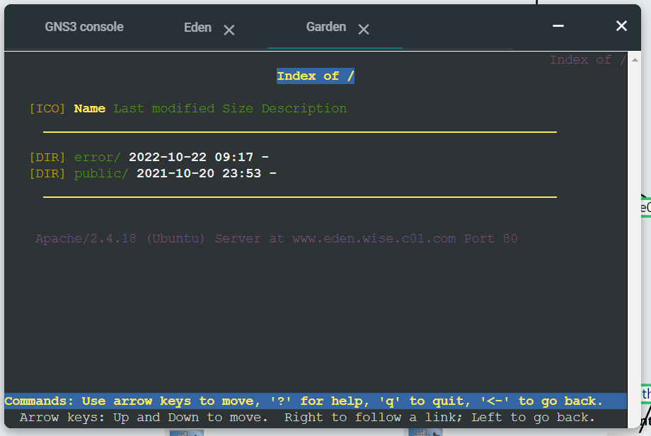
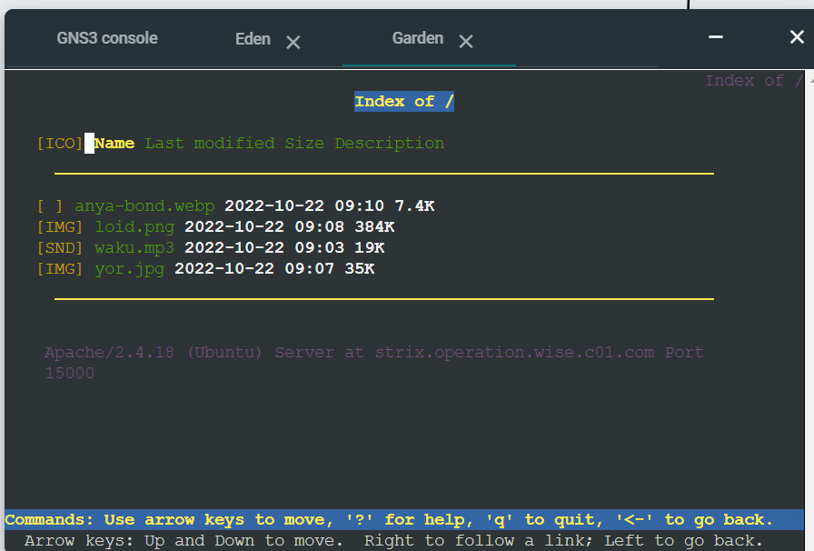

# Jarkom-Modul-2-C01-2022

## **DNS**

#### soal 1-7

## Topologi

Berikut adalah topologi dengan rincian berikut: WISE akan dijadikan sebagai DNS Master, Berlint akan dijadikan DNS Slave, dan Eden akan digunakan sebagai Web Server. Terdapat 2 Client yaitu SSS, dan Garden. Semua node terhubung pada router Ostania, sehingga dapat mengakses internet.


### **DNS Master Wise**


Pada Wise, file bind disambungkan pada /etc/bind/jarkom/c01.com sebagai config c01.com dan /etc/bind/jarkom/2.10.10.in-addr.arpa sebagai reverse domain.
Pada konfigurasi zone c01.com, diberi setup also notify dan allow-transfer ip 10.10.2.2. Hal ini bertujuan supaya ip tersebut menjadi DNS slave ketika DNS master dimatikan.


Di atas adalah konfigurasi bind c01.com, terdapat beberapa hal antara lain:

1. c01.com merupakan ns dari wise
2. c01.com akan menerjemahkan ke ip 10.10.2.3
3. wise merupakan konfigurasi subdomain yang merujuk pada ip 10.10.2.3 dengan domain wise.c01.com
4. www.wise merupakan alias dari wise.c01.com
5. eden.wise merupakan konfigurasi subdomain yang merujuk pada ip 10.10.2.3 dengan domain eden.wise.c01.com
6. www.eden.wise.c01.com merupakan alias dari eden.wise.c01.com
7. operasion.wise merupakan delegasi subdomain untuk ip 10.10.2.2


Di atas merupakan konfigurasi reverse domain dari c01.com


di atas adalah konfigurasi option config, perbedaan yang paling nampak adalah dengan mengcomment dnssec-validation auto dan menambahkan allow-query{any} untuk mengaktifkan DNS slave.

## **Script Wise**

```bash
echo nameserver 192.168.122.1 > /etc/resolv.conf

apt-get update
wait

apt-get install bind9 -y
wait

cat /root/conf_domain.txt > /etc/bind/named.conf.local

mkdir /etc/bind/jarkom
cp /etc/bind/db.local /etc/bind/jarkom/c01.com
cat /root/conf_bind_c01.txt > /etc/bind/jarkom/c01.com

cp /etc/bind/db.local /etc/bind/jarkom/2.10.10.in-addr.arpa
cat /root/conf_reverse_domain.txt > /etc/bind/jarkom/2.10.10.in-addr.arpa

cat /root/conf_options.txt > /etc/bind/named.conf.options

service bind9 start
```

Pada kode di atas, setiap konfig disimpan pada file txt. Isi dari file txt sama seperti yang telah ditampilkan di atas. Pada script, pertama memasukkan ip nameserver pada konfigutasi supaya terhubung langsung dengan ostania dan dapat mengakses internet. Kemudian menginstal bind9 untuk konfigurasi DNS. setelah itu, memasukkan setiap konfig dari file yang telah disetup ke setiap direktori yang telah ditentukan. Terakhir adalah menstart bind9 dengan command service bind9 start supaya konfigurasi DNS server diterapkan dan DNS dapat berjalan dengan semestinya.


## **DNS Slave dan Delegasi Berlint**


Pada local konfig, Berlint dikonfigurasi sebagai DNS slave dari c01,com dengan ip master 10.10.3.2. Kemudian Berlint mendapatkan delegasi domain operation.wise.c01.com.


di atas adalah konfigurasi option config, perbedaan yang paling nampak adalah dengan mengcomment dnssec-validation auto dan menambahkan allow-query{any} untuk mengaktifkan DNS slave.


Di atas adalah konfig pendelegasioan operation.wise.c01.com. Domain itu akan merujuk pada IP 10.10.2.3 atau ip dari Berlint. Selain itu, diberikan alias name www pada domain ini.

strix ditambahkan menjadi subdomain dari operation.wise.com kemudian diberi alias dengan www.strix yang merujuk pada strix.operation.wise.c01.com

## **Script Berlint**

```bash
echo nameserver 192.168.122.1 > /etc/resolv.conf

apt-get update
wait

apt-get install bind9 -y
wait

cat /root/conf_domain.txt > /etc/bind/named.conf.local

mkdir /etc/bind/delegasi
cp /etc/bind/db.local /etc/bind/delegasi/operation.wise.c01.com
cat /root/conf_bind_c01.txt > /etc/bind/delegasi/operation.wise.c01.com

cat /root/conf_options.txt > /etc/bind/named.conf.options

service bind9 start
```
Inti dari script Berlint sama dengan Wise. Perbedaannya adalah Berlint sebagai DNS slave dan mendapatkan delegasi sehingga file confignya sediki berbeda denan wise.

#### Soal 8, 9
Melakukan download file untuk www.wise.c01.com
```bash
if [ ! -d "/var/www/wise.c01.com/" ]
then
    wget --no-check-certificate 'https://drive.google.com/uc?export=download&id=1S0XhL9ViYN7TyCj2W66BNEXQD2AAAw2e' -O wise.c01.com.zip
    unzip wise.c01.com.zip -d /var/www/
    mv /var/www/wise /var/www/wise.c01.com
fi
```
Membuat file config dan start webserver
```bash
touch /etc/apache2/sites-available/wise.c01.com.conf
cat conf_wise.txt > /etc/apache2/sites-available/wise.c01.com.conf
a2ensite wise.c01.com
```
Pada, `conf_wise.txt` memakai alias untuk mengubah /home menjadi /index.php/homw
```
	ServerAdmin webmaster@localhost
	DocumentRoot /var/www/wise.c01.com
	ServerName wise.c01.com
	ServerAlias www.wise.c01.com
	Alias "/home" "/var/www/wise.c01.com/index.php"
```


#### Soal 10 - 13
Seperti dengan nomor 8, menggunakan wget untuk copy file di drive
```bash
if [ ! -d "/var/www/eden.wise.c01.com/" ]
then
wget --no-check-certificate 'https://drive.google.com/uc?export=download&id=1q9g6nM85bW5T9f5yoyXtDqonUKKCHOTV' -O eden.wise.c01.com.zip
unzip eden.wise.c01.com.zip -d /var/www/
mv /var/www/eden.wise /var/www/eden.wise.c01.com
fi

touch /etc/apache2/sites-available/eden.wise.c01.com.conf
cat conf_eden.wise.txt > /etc/apache2/sites-available/eden.wise.c01.com.conf
a2ensite eden.wise.c01.com
```
Menambah options indexes untuk dapat melakukan directory listing
```
<Directory /var/www/eden.wise.c01.com/public>
    Options +Indexes
</Directory>
```
Menggunakan alias untuk menyingkatkan public/js
```
Alias "/js" "/var/www/eden.wise.c01.com/public/js"
```
Untuk dapat menggunakan error page custom, ditulis di conf file:
```
ErrorDocument 404 /error/404.html
```



#### Soal 14 - 17
Membuat webserver strix
```bash
if [ ! -d "/var/www/strix.operation.wise.c01.com/" ]
then
    wget --no-check-certificate 'https://drive.google.com/uc?export=download&id=1bgd3B6VtDtVv2ouqyM8wLyZGzK5C9maT' -O www.strix.operation.wise.c01.com.zip
    unzip www.strix.operation.wise.c01.com.zip -d /var/www/
    mv /var/www/strix.operation.wise /var/www/strix.operation.wise.c01.com
fi

touch /etc/apache2/sites-available/strix.operation..wise.c01.com.conf
cat conf_strix.wise.txt > /etc/apache2/sites-available/strix.operation.wise.c01.com.conf
a2ensite strix.operation.wise.c01.com
```
Copy file config ports untuk dapat menggunakan port 15000 dan 15500
```bash
cat conf_ports.txt > /etc/apache2/ports.conf
```
Pada isi file ports
```
Listen 80
Listen 15000
Listen 15500
```
Membuat file account agar dapat digunakan untuk login pada strix, password terinkripsi
```bash
echo 'Twilight:$apr1$3/xfxIfk$lBhxFHYIej9Nbisg2UyLB/' > /etc/apache2/.htpasswd
```
Untuk dapat melakukan login, tambahkan .htaccess
```bash
echo 'AuthType Basic
AuthName "Restricted Content"
AuthUserFile /etc/apache2/.htpasswd
Require valid-user' > /var/www/strix.operation.wise.c01.com/.htaccess
```
Menggunakan rewrite untuk dapat 10.10.2.3 (ip dari eden) redirect ke wise.c01.com
```bash
echo 'RewriteEngine On
RewriteBase /
RewriteCond %{HTTP_HOST} ^10\.10\.2\.3$
RewriteRule ^(.*)$ http://www.wise.c01.com [L,R=301]' > /var/www/html/.htaccess
```
Menggunakan rewrite untuk dapat arahkan query gambar dengan substring eden ke eden.png
```bash
echo 'RewriteEngine On
RewriteRule ^(.*)eden(.*)(jpg|gif|png)$ http://eden.wise.c01.com/public/images/eden.png [L,R]' > /var/www/eden.wise.c01.com/.htaccess
```



## Tambahan

Kesulitan: Tidak Ada

Selesai Praktikum: no 1-13

Selesai Revisi: no 14-17
